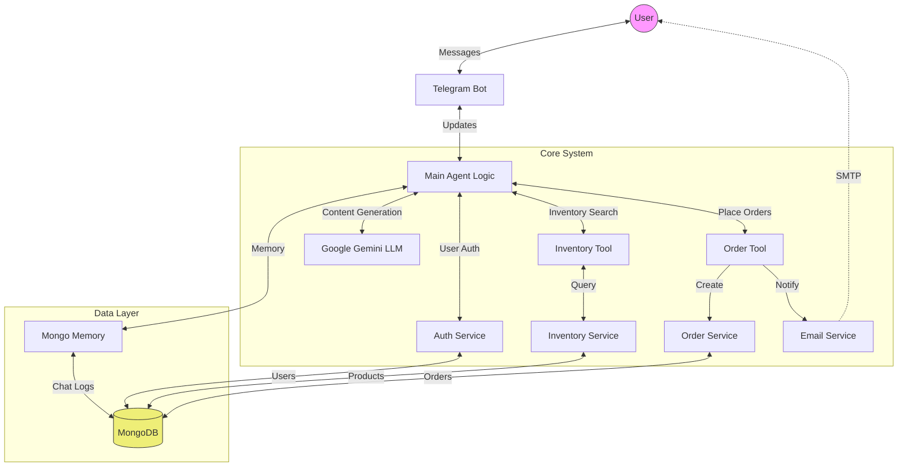
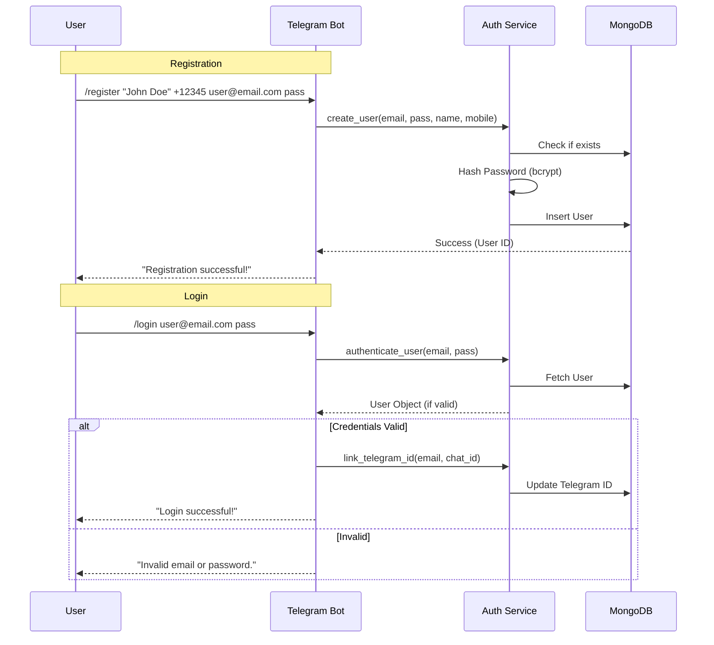
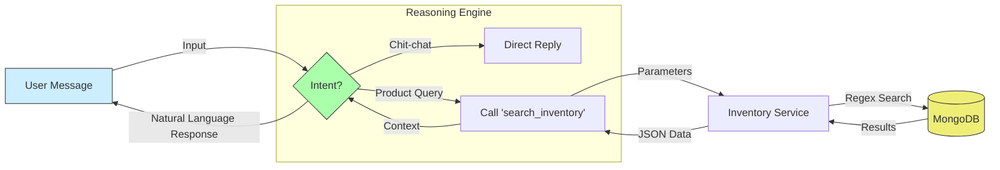
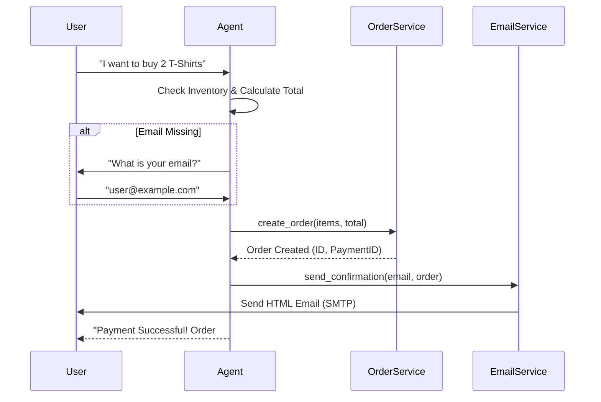

# SalesMate.ai


**SalesMate.ai** is an intelligent Telegram-based sales agent designed for fashion brands. It leverages the power of Large Language Models (LLM) to understand natural language queries, manage user sessions, and search product inventory seamlessly.

## System Architecture

The following diagram illustrates the high-level architecture of SalesMate.ai:



## Features

- **Secure Authentication**: Register and login securely via Telegram commands.
- **Natural Language Search**: Ask vague questions like "Show me some summer dresses" and get precise results.
- **Visual Shopping**: View product images directly within the chat for a better shopping experience.
- **Conversational Memory**: The bot remembers your preferences and context (e.g., size), allowing for seamless follow-up questions.
- **Order System**: "Buy" products directly in the chat. The bot calculates totals, creates orders, and simulates payments.
- **Real-time Notifications**: Receive professional HTML email confirmations with order details via SMTP.
- **Contextual AI**: Uses Google's Gemini-1.5-flash for understanding user intent and context.

## Workflows

### 1. User Registration & Login Flow

Users must authenticate to link their Telegram account with the system.



### 2. Inventory Search Flow

The AI Agent autonomously decides when to query the database based on user messages.



### 3. Order & Payment Flow

Seamlessly buy products and receive email confirmations.



## Setup & Installation

### Prerequisites

- Python 3.9+
- MongoDB Instance (Local or Atlas)
- Telegram Bot Token (from @BotFather)
- Gemini API Key
- SMTP Credentials (for emails)

### Installation

1. **Clone the repository**

   ```bash
   git clone https://github.com/udaykumar-dhokia/SalesMate.ai.git
   cd SalesMate.ai/agent
   ```

2. **Install dependencies**

   ```bash
   python -m venv venv
   source venv/bin/activate
   pip install -r requirements.txt
   ```

3. **Configure Environment**
   Create a `.env` file in the `agent` directory:

   ```env
   TELEGRAM_BOT_TOKEN=your_bot_token
   GEMINI_API_KEY=your_gemini_key
   MONGODB_URL=mongodb://localhost:27017/

   # SMTP Configuration (Gmail Example)
   SMTP_SERVER=smtp.gmail.com
   SMTP_PORT=587
   SMTP_USERNAME=your_email@gmail.com
   SMTP_PASSWORD=your_app_password
   ```

4. **Seed Database**
   Populate the database with dummy data:

   ```bash
   python scripts/seed_inventory.py
   ```

5. **Run the Bot**
   ```bash
   python main.py
   ```

### Docker Support

Alternatively, you can run the entire system (Agent + MongoDB) using Docker.

1.  **Build and Run**:

    ```bash
    docker-compose up --build
    ```

    The bot will start, and MongoDB will be available automatically.

## Tech Stack

- **Language**: Python 3.13
- **LLM Framework**: LangChain & LangGraph
- **Model**: Google Gemini 1.5 Flash
- **Database**: MongoDB
- **Interface**: Python Telegram Bot
